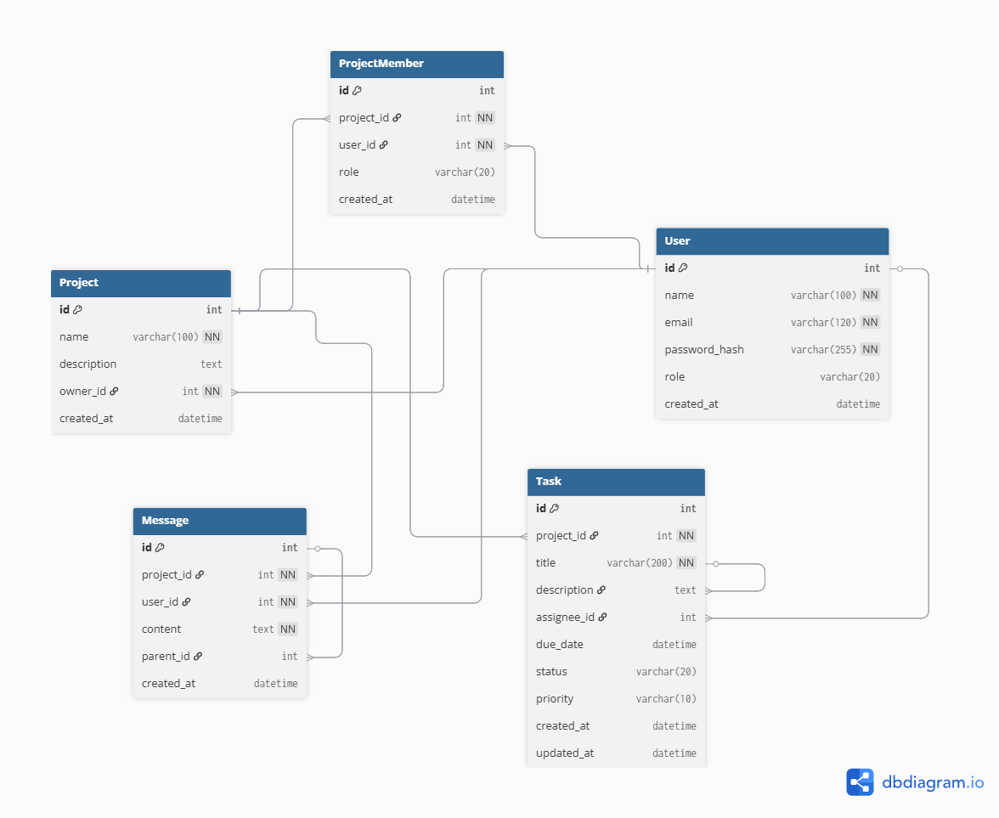

# 🚀 SynergySphere – Advanced Team Collaboration Platform

## 🌟 Overview
SynergySphere is a smart team collaboration platform that goes **beyond traditional project management**.  
It acts as the **central nervous system for teams**, combining **task management, communication, and progress tracking** into one seamless solution.  

Our goal is simple: help teams **stay aligned, work smarter, and achieve more** — without scattered tools or missed updates.

---

## 🎥 Demo Video
👉 *(Placeholder – Add link after recording demo video)*  
``  

---

## 🗄️ Database Design

---

## 🎯 Mission
- Build a platform that is **intelligent, proactive, and user-friendly**.  
- Empower teams to **organize projects, assign tasks, and communicate effectively**.  
- Prevent common collaboration issues like **unclear progress, deadline surprises, and lost conversations**.  

---

## 🔑 Core Features (MVP)
1. **User Authentication** – Secure sign-up & login (with forgot password option).  
2. **Project Dashboard** – Create/manage projects with a clean overview.  
3. **Team Management** – Add members and assign responsibilities.  
4. **Task Management** – Create tasks with **title, description, assignee, deadline, and status** (To-Do, In Progress, Done).  
5. **Collaboration** – Threaded discussions inside each project.  
6. **Progress Tracking** – Simple visualization of tasks and deadlines.  
7. **Notifications** – Alerts for key project updates.  
8. **Profile & Settings** – Manage user details and basic preferences.  

---

## 🛠️ Tech Stack (Proposed)
- **Frontend:** React (Web) + React Native (Mobile)  
- **Backend:** Node.js + Express  
- **Database:** MongoDB / PostgreSQL  
- **Authentication:** JWT (JSON Web Tokens)  
- **Deployment:** Docker + AWS / Vercel / Heroku  

---

## 📱 Wireframes
- **Mobile MVP** → Quick access to tasks, updates, and notifications.  
- **Desktop MVP** → A **command center** for managers and teams to track project progress.  

👉 [View Wireframes](https://link.excalidraw.com/l/65VNwvy7c4X/8ftMG5DsBJ6)

---

## 🏆 Deliverables for Hackathon
- Fully functional **MVP (Minimum Viable Product)** for web & mobile.  
- Core features: **Authentication, Projects, Tasks, Communication, Progress Tracking**.  
- **Clean, responsive, and efficient** UI/UX design.  

---

## 💡 Why SynergySphere?
Most project tools just **organize** work.  
SynergySphere goes further — it **orchestrates collaboration intelligently** by keeping information centralized, surfacing potential issues early, and making teamwork **seamless and productive**.

---

## 👥 Team Vision
We believe the best teams deserve the best tools.  
With SynergySphere, collaboration feels **natural, proactive, and stress-free** — so teams can focus on what really matters: **building great things together**.  

